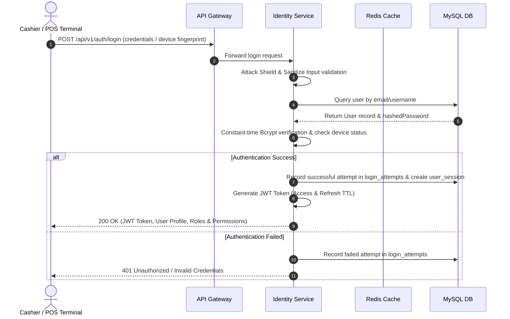
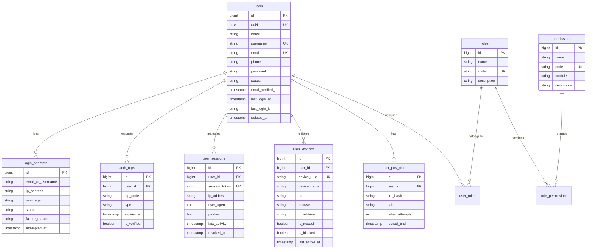
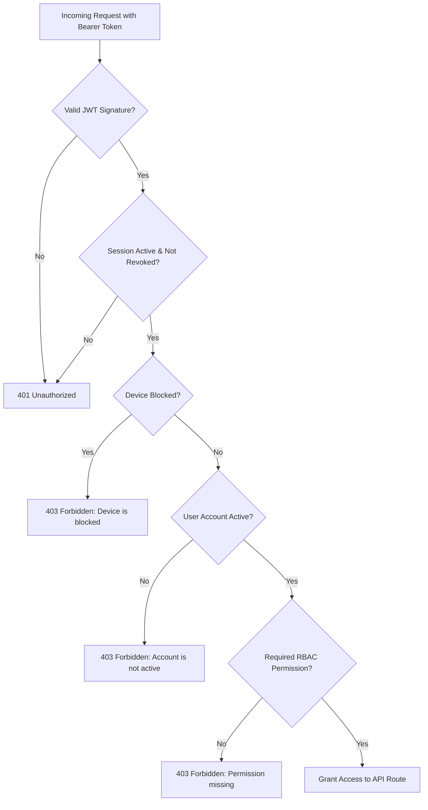

# SmartPOS Identity Service — System Architecture & Design Document

> **Document Version:** 1.1.0  
> **Last Updated:** August 2026  
> **Service Name:** `smartpos/identity-service`  
> **Repository:** SmartPOS Platform Ecosystem  

---

## 1. Executive Summary & System Overview

**SmartPOS Identity Service** (`smartpos/identity-service`) is the foundational identity provider (IdP), authentication engine, and access control microservice for the SmartPOS retail and point-of-sale ecosystem.

It provides centralized user management, JWT token-based authentication, fine-grained Role-Based Access Control (RBAC), cashier POS PIN security, device trust management, user session revocation, automated attack shield protection, OWASP security headers, and security audit logging.

```
                    +-------------------------------------------------+
                    |                SmartPOS Clients                 |
                    |   (Mobile POS, Web Admin, Terminal Hardware)    |
                    +------------------------+------------------------+
                                             | HTTP / REST (v1)
                                             v
                    +-------------------------------------------------+
                    |              API Gateway / Ingress              |
                    +------------------------+------------------------+
                                             |
                                             v
                    +-------------------------------------------------+
                    |      SmartPOS Identity Service (Laravel 12)     |
                    |   +-----------------------------------------+   |
                    |   |  Security Headers & Attack Shield Guard |   |
                    |   +-----------------------------------------+   |
                    |   |  JWT Auth & Session/Device Verifier     |   |
                    |   +-----------------------------------------+   |
                    |   |  RBAC (Users, Roles, Permissions)       |   |
                    |   +-----------------------------------------+   |
                    |   |  POS Quick-PIN & Device Trust Engine    |   |
                    |   +-----------------------------------------+   |
                    +------------+-----------------------+------------+
                                 |                       |
                                 v                       v
                    +------------------------+ +----------------------+
                    |  MySQL 8.4 (Data Store)| | Redis 8 (Token/Cache)|
                    +------------------------+ +----------------------+
```

---

## 2. High-Level System Architecture

### 2.1 Technology Stack

| Layer | Component | Technology / Library |
| :--- | :--- | :--- |
| **Runtime Environment** | Language & Engine | PHP 8.3+ |
| **Framework** | Web Framework | Laravel 12.x / 13.x |
| **Authentication** | Token Engine | `php-open-source-saver/jwt-auth` v2.9 |
| **API Documentation** | OpenAPI Generator | Dedoc Scramble (`/docs/api`) |
| **Primary Relational DB** | Storage & Persistence | MySQL 8.4 (InnoDB, UTF8mb4) |
| **Caching & Session DB** | Cache & Token Blacklist | Redis 8 |
| **Media & Image Engine** | Image Processing & Storage | `Intervention Image` (GD Driver) & WebP Disk Storage |
| **Security Shields** | Threat & Bot Filtering | Custom Middleware Pipeline (OWASP Headers, AttackShield, SanitizeInput) |
| **Containerization** | Infrastructure | Docker & Docker Compose |

---

### 2.2 System Context & Request Execution Flow



---

## 3. Database Architecture & Data Schema

The database design relies on 13 migrations that enforce relational integrity, index efficiency, and security isolation.



---

## 4. Security Architecture & Threat Defense

### 4.1 Token Lifecycle & Revocation
- **JWT Standard Claims:** Issued with `sub` (User ID), `sid` (Session UUID), `device_uuid`, `iat`, `exp`, `nbf`, and `jti` (unique JWT ID).
- **Blacklisting via Redis:** Upon explicit logout (`POST /api/v1/auth/logout`) or session termination, the token JTI is pushed to Redis with an expiration matching the token's remaining TTL.



---

### 4.2 Middleware Security Pipeline

Every incoming HTTP request passes through a multi-tiered defense-in-depth pipeline:

```
Route Request
     │
     ▼
[ Security Headers Middleware ] ---> Injects OWASP headers, strips X-Powered-By
     │
     ▼
[ Attack Shield Middleware ] ------> Blocks scanner User-Agents (sqlmap, nikto), sensitive path probes (/.env), and path traversal
     │
     ▼
[ Sanitize Input Middleware ] -----> Enforces 2MB JSON body size limit, strips null-bytes (\0) and malformed UTF-8
     │
     ▼
[ Throttle Middleware ] -----------> Rate limits endpoints (e.g. 10/min login, 5/min register, 20/min refresh)
     │
     ▼
[ Auth Guard (auth:api) ] ---------> Validates JWT signature, expiration timestamp, and loads User model
     │
     ▼
[ Session & Device Guard ] --------> EnsureDeviceAndSessionActive.php (Validates revoked sessions, expired sessions & blocked devices)
     │
     ▼
[ RBAC Guard ] --------------------> CheckPermission.php & CheckRole.php (Verifies permission/role requirements)
     │
     ▼
[ Controller Execution ] ----------> Business Logic Execution
```

---

### 4.3 Defense-in-Depth & Application Hardening

1. **OWASP HTTP Security Headers:**
   - `X-Content-Type-Options: nosniff`
   - `X-Frame-Options: DENY`
   - `X-XSS-Protection: 1; mode=block`
   - `Referrer-Policy: strict-origin-when-cross-origin`
   - `Content-Security-Policy: default-src 'none'; frame-ancestors 'none';`
   - `Strict-Transport-Security: max-age=31536000; includeSubDomains`
   - `Permissions-Policy: accelerometer=(), camera=(), geolocation=(), ...`

2. **Scanner & Reconnaissance Shield:**
   - Blocks automated tools (e.g. `sqlmap`, `nikto`, `hydra`, `metasploit`, `nmap`, `arachni`).
   - Intercepts sensitive probes targeting configuration files (`/.env`, `/.git`, `/.aws`, `/dump.sql`, `/backup.sql`).

3. **User Enumeration & Timing Attack Mitigation:**
   - Forgot-password OTP endpoint returns uniform messages (`"If the email exists, a verification code has been sent."`) regardless of user existence.
   - Login credential verification performs constant-time dummy hash verification when a username/email does not exist, eliminating timing disparity.

4. **Real-Time Device & Session Enforcement:**
   - Tokens carry `sid` (session UUID).
   - Any device marked `is_blocked = 1` or session marked `revoked_at` is immediately rejected across **all** protected endpoints with `403 Forbidden` / `401 Unauthorized`.

5. **POS Terminal Quick-PIN Security:**
   - Salted hashing for 4-6 digit numeric PINs.
   - Lockout threshold: 5 consecutive failed attempts trigger a 15-minute lock on `locked_until` (returning `423 Locked`).

6. **3-Step OTP Password Reset Workflow:**
   - Step 1: `POST /api/v1/auth/forgot-password/send-code` generates random 6-digit OTP with 10-minute TTL.
   - Step 2: `POST /api/v1/auth/verify-reset-code` validates OTP (5 max attempts before self-destruct).
   - Step 3: `POST /api/v1/auth/reset-password` consumes verified OTP, updates password, and revokes all active sessions.

---

## 5. API Module Summary

All endpoints are hosted under prefix `/api/v1`.

| Module | Sub-Module | Key Capabilities |
| :--- | :--- | :--- |
| **Auth** | Authentication | Login, Registration, JWT Refresh, Token Blacklist Logout, Profile (`/auth/me`). |
| **Auth** | Password Recovery | OTP Generation, OTP Code Verification, Password Reset. |
| **Users** | User Management | Admin CRUD operations for user accounts with soft deletion support. |
| **Users** | Avatar Processing | Upload (`POST /users/{user}/avatar`), automatic WebP conversion, file cleanup (`DELETE /users/{user}/avatar`). |
| **RBAC** | Roles & Permissions | Dynamic Role definition, Permission creation, Role-Permission sync, Business Role Auto-Provisioning (`POST /roles/provision`). |
| **RBAC** | User Roles | Assigning or revoking roles to users (`/users/{user}/roles`). |
| **Terminal** | POS PIN | Fast PIN creation, updates, and terminal cashier validation (`/users/{user}/pos-pin/verify`). |
| **Security** | Device Trust | Register devices, set trusted flag (`is_trusted`), block device (`is_blocked`). |
| **Security** | Sessions | Active user session tracking, single session revoke, purge all active sessions. |
| **Audit** | Audit Logs | Complete login attempt tracking (`success`/`failed` with IP & User-Agent). |

---

### 5.1 Media & Storage Architecture (User Avatars)

- **Storage Path:** Uploaded avatars are processed and written to `storage/app/public/avatars/`.
- **Public URL Resolution:** Accessible via `/storage/avatars/{filename}` when symbolic link is active (`php artisan storage:link`).
- **Format Normalization & Optimization (`AvatarService`):**
  - Accepts `jpeg`, `png`, and `webp` images up to 5MB (`max:5120`).
  - Converts incoming images into optimized `.webp` files using GD Driver (`imagewebp`).
  - Automatically deletes old avatar files upon new file upload or explicit deletion.
- **Controller Layer (`UserAvatarController`):**
  - `POST /api/v1/users/{uuid}/avatar` — Validates upload request and triggers conversion.
  - `DELETE /api/v1/users/{uuid}/avatar` — Purges file from disk and resets `users.avatar` DB column to `null`.

---

## 6. Containerization & Deployment Architecture

The application is containerized using Docker & Docker Compose:

```
                          +-----------------------------------+
                          |        Docker Container Network   |
                          |        (smartpos-identity-net)     |
                          +-----------------+-----------------+
                                            |
        +-----------------------------------+-----------------------------------+
        |                                   |                                   |
        v                                   v                                   v
+---------------+                   +---------------+                   +---------------+
|   app (PHP)   |                   |  db (MySQL)   |                   | redis (Cache) |
| Port: 8001    |                   | Port: 3307    |                   | Port: 6380    |
+---------------+                   +---------------+                   +---------------+
        |                                   |
        +------------------+----------------+
                           |
                           v
                   +---------------+
                   |  phpMyAdmin   |
                   | Port: 8081    |
                   +---------------+
```

---

## 7. Task Progress & Development Roadmap

### 7.1 ✅ Completed Milestones

- [x] **Database Schema Foundation:** Built 13 robust migrations covering users, roles, permissions, devices, sessions, POS PINs, and login attempts.
- [x] **Authentication Engine:** Complete JWT authentication flow using `jwt-auth`, including registration, login, token refresh, and logout.
- [x] **Password Recovery System:** 3-step OTP-based password reset workflow with anti-enumeration protection.
- [x] **Full RBAC System:** Implemented dynamic Roles & Permissions, including mapping models and middleware (`CheckPermission` & `CheckRole`).
- [x] **POS Terminal PIN Engine:** Hashed PIN registration, update, and quick-verify endpoint with brute-force lockout.
- [x] **User Avatar System:** WebP avatar conversion service (`AvatarService`), upload/delete controller (`UserAvatarController`), public storage link, and feature test suite.
- [x] **Device Trust & Session Management:** Device tracking, trusted/blocked status management, remote session revocation APIs, and global `EnsureDeviceAndSessionActive` middleware.
- [x] **Defense-in-Depth Pipeline:** `SecurityHeadersMiddleware`, `AttackShieldMiddleware`, `SanitizeInputMiddleware`, and constant-time login verification.
- [x] **Automated Security Test Suite:** 67 automated test cases passing across Unit, Feature, RBAC, Pentest, and Session/Device security suites.
- [x] **Multi-Container Infrastructure:** Complete Docker Compose deployment setup with MySQL 8.4, Redis 8, and phpMyAdmin integration.
- [x] **API Auto-Documentation:** Scramble OpenAPI documentation integrated at `/docs/api`.

---

### 7.2 📋 Actionable Roadmap & Priority Backlog

#### Phase 2: Live Delivery & Response Transformers (Target: Q3 2026)
- [ ] **Gmail SMTP Mailer Integration:** Configure SMTP credentials for live delivery of password reset OTPs.
- [ ] **Telegram Bot OTP Dispatch:** Dispatch OTP verification codes via Telegram webhook/bot.
- [ ] **API Response Standardization:** Standardize API Resources (`UserResource`, `RoleResource`, `UserDeviceResource`) with a unified response envelope.

#### Phase 3: Anomaly Detection & Geolocation (Target: Q4 2026)
- [ ] **GeoIP & Anomaly Detection:** Flag suspicious logins from unexpected countries or unusual IP ranges.

#### Phase 4: Enterprise Scale (Target: 2027)
- [ ] **OAuth2 / OIDC Provider Integration.**
- [ ] **Passkeys / WebAuthn Biometric Authentication for POS Hardware.**
